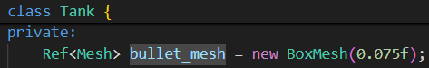

# Minidot

**Minidot is a demake @godotengine** built under old immediate mode [freeglut](https://freeglut.sourceforge.net/) (i.e. `glBegin`'s and `glEnd`'s) and C++.  
Though old, Minidot have a complete [node tree system](https://docs.godotengine.org/en/stable/getting_started/introduction/key_concepts_overview.html#nodes) and a global vertex-fragment shader. All built from scratch by myself.

The repo contains a tank game demo with cel shading, written in `main.cpp`, `phong_vertex.glsl`, and `phong_fragment.glsl`.

## Features
**Node tree with 2D & 3D node coexists**

- another `mesh_list_2d`/`3d` in `RenderServer` records and renders meshes to prevent tree traversal in every frame.   
- useful for 3D scene's HUD, e.g., red sight in First Person View

**Demake Delegate, aka [signal system](https://docs.godotengine.org/en/stable/classes/class_signal.html), aka [Observer](https://gameprogrammingpatterns.com/observer.html)**

  
   

- delegate `tree_entered` helps `Node2D`/`Node3D` cache parent node, `Camera3D` register to `Viewport` (transform manager), etc.

**Hierarchical Transformation with [Dirty Flag](https://gameprogrammingpatterns.com/dirty-flag.html)**

- imlemented by operator overloading with `Vector` and `Transform`
- support translation & rotation, e.g., `Tank` class in `main.cpp`

**One mesh sharing by multiple MeshInstance, i.e., [Flyweight](https://gameprogrammingpatterns.com/flyweight.html)** 
 

  
   

- Templated Polymorphism Reference Counting, successfully implemented, in `templates/ref.h` 

**Multi-light source Cel Shaing by Phong Shaing with Rim.**

- beside built in `BoxMesh`, `ArrayMesh` allows external 3D models be rendered within the framework, e.g., `main.c` imports `rubber_duck.smf`. 

I keep Minidot source files as simple and reabilable as I can, so Minidot could be developed under [YAGNI](https://en.wikipedia.org/wiki/You_aren%27t_gonna_need_it). Hope it help if you're interested in any of these features!  

## Download & Execute 
Github's Release contains the executable and all dependencies  needed for Windows. Windows users can directly download and execute the demo from there.

As for other operating system users, please try compiling from source.  
### Compile from source 
1. Download [freeglut](https://freeglut.sourceforge.net/) and [glew](https://freeglut.sourceforge.net/) for your operating system.  
    >For Windows, I use [MSYS2](https://www.msys2.org/) as C/C++ environment and install them following [this(freeglut)](https://packages.msys2.org/packages/mingw-w64-ucrt-x86_64-freeglut) and [this(glew)](https://packages.msys2.org/packages/mingw-w64-ucrt-x86_64-glew).   

2. Ensure your `opengl32`, `libfreeglut`, and `glew32` shared  library files are reachable by executable in project root, i.e., in folders included in PATH or in project root too.  
    > For example, my shared library files are `.dll`s. They are in: `C:\Windows\System32\opengl32.dll`, `C:\msys64\ucrt64\bin\libfreeglut.dll`, and `C:\msys64\ucrt64\bin\glew32.dll`. My PATH includes `C:\Windows\System32` and `C:\msys64\ucrt64\bin` so I'm good to go.
    
3. Use [Make](https://www.gnu.org/software/make/manual/make.html) and the Makefile. Open terminal within the project root. Enter `make`. It shall successfully builds the executable `main`. If it fails, please try step 4 and 5 to see if the error messages be lessened or not. 
    > I use [Make provided by MSYS2](https://packages.msys2.org/packages/mingw-w64-ucrt-x86_64-make). Enter `mingw32-make` and you will get `main.exe`.

    Tip: Try speed up the compilation by `make -j<number>` to utilize your multicore CPU!
    > For example, `make -j8`.
4. Ensure your C++ compiler can find all header files downloaded in `/GL` folder.
    > My `/GL` folder is `C:\msys64\ucrt64\include\GL`.  

    If compiler fails to find them, modify `./Makefile`. Fine line `GLUT_INCLUDE_ARGU := -I"./GLUT_env"`. Change `./GLUT_env` to the path containing `/GL` headers.
    > For me, the line should be `GLUT_INCLUDE_ARGU := -I"C:\msys64\ucrt64\include"`

5.  Ensure your C++ compiler can find static libraries of `libfreeglut` and `libglew32`
    > My static libraries are `C:\msys64\ucrt64\lib\libfreeglut.dll.a` and `C:\msys64\ucrt64\lib\libglew.dll.a`.  

    If compiler fails to find them, modify `./Makefile`. Fine line `GLUT_LIB_ARGU := -L"./GLUT_env"`. Change `./GLUT_env` to the path containing those static libraries.
    > For me, the line should be `GLUT_LIB_ARGU := -L"C:\msys64\ucrt64\lib"`
6. Still get problems? Feel free to open an Issue on Github. I'll help as much as I can! 

## Controls 
`w`, `a`, `s`, `d`: move your red tank related to world position    
`left`, `right`: rotate the cannon base of your tank    
`up`, `down`: adjust fire angle of your cannon  
`space`: fire your cannon     

`q`, `e`: move world camera forward/backward  
`z`, `c`: move world camera leftward/rightward  
`r`, `v`: move world camera upward/downward  

`f`: toggle the camera between first person view and third person view.  
`x`: toggle center light color between pink and white.  
## P.S.
Making a big and serious C++ project *is* hard!   
So many details need to be handled. So many design decisions need to be made.
So many time need to be spent. 

Thanks for @godotengine creaters and communities sharing your blood and tears, *for free*.   
Predecessors, you have my greatest respect.

<!-- ### 如何在沒有 `GLUT_env` folder 下編譯 
0. 總之先下 make，沒編譯出 `.exe` 再來看~
    - MinGW 使用者，或許能試試下 `mingw32-make`
1. 開 makefile，確認 "GLUT parameters" 區域
    - USING_GLUT: GLUT 的 `.lib` 或 `lib .dll.a` 的名字
    - GLUT_INCLUDE_ARGU: 放 `glut.h` 的資料夾路徑
    - GLUT_LIB_ARGU: 放 `.lib` 或 `lib .dll.a` 的資料夾路徑
2. 確認 `glut.h` 有沒有放在 `GL` 資料夾下面
    - 有: 請 `#include <GL/glut.h>`
    - 沒: 請 `#include <glut.h>`
3. 確認 GLUT 的 .dll 檔在 PATH ，或在 `.exe` 同一個資料夾下，能被 `.exe` 存取到
4. 確認 GLUT 的 .dll 檔是 64 bits 的，32 bits 版無法 link
5. 還不行？ 我也不知道，請聯繫我！ -->

<!-- # 參考資料
- 依我的理解簡化(刻/抄)了 Godot node 系統: https://github.com/godotengine/godot/tree/master
    - nodes 做主要 object, memory management
        - 簡化: Godot Node2D 會經過 CanvaItem Node, 多了 layer 控制功能，我們改採用 Node3D 設計概念: https://github.com/godotengine/godot/blob/master/scene/3d/node_3d.h  
        - 簡化: Godot 以 RenderServer 內容物(World3D) draw, 以達到 implement independent, 我們直接畫出 child nodes 就好
            - 想法、未實作: multi-viewport, 可實作 SubViewport Node, 紀錄主 Viewport, draw 時以主 Viewport child nodes transform 乘上 SubViewport 自己 view transform, 再 render 一次即可
                - 記得 render 要使用原本的 dfs_stack, 主 Viewport 才不會重複 render 到 SubViewport child
        - 簡化: Godot 用神奇 ClassDB 實現 signal(command pattern) in Object Class for C++, C#, GDscript 互通，我們用 delegate.h 實作即可(放在 ./templates 裡)
        - 簡化: Godot 原本會用 Control Node 處理全部 UI ，我改用 Node2D-derived Node 就好~

    - resources 存 data (可以 multiple node 共用 1 resource)
        - 簡化: Godot 的 Line 以 Line2D Node implement, 把底層 Mesh 隱藏起來, 使用上比較方便 + width 能 scaling, 我們改直接用 LineMesh (width 不能 scaling...) 
        - 簡化: Godot 的 ArrayMesh 能用 Vertices Array 外東西去畫, 我們只用 Vertices Array  
        - 簡化: Godot Texture 不只 ImageTexture 還有 MeshTexture, NoiseTexture...，我們只能放 Image, 所以沒有 derived classes
            - 簡化: Godot Image loading 有專門 singleton, 能在不同地方使用 Image，不需要，不實做 Image singleton 了

    - servers 使用 nodes 與 resources，更新 node tree 或 Output  
        - 簡化: Godot 的 resources 真的只存 data, function implement 都在 servers, 這樣能同時支援 OpenGL, Vulkan 等，我們改在 resources 直接 implement，server 不用寫每個 resource 對應接口~
        - 改: Godot 處理 input 功能包在 DisplayServer 裡了，我不太喜歡，自創 InputServer

    - templates 放常用的 data type
    - config 放設定檔
    - thirdparty 放不是我寫的 code: 如 file praser
        - 老師提供的 bmp_io 是用 library(Visual Studio 的)匯入 + 小修正，好像也沒 100% detailed, 所以選擇用完整 image file parse library: stb (一樣回傳 RGB pixel array)
        
- 畫 .bmp: ChatGPT + stackoverflow 互相修正結果
    - https://stackoverflow.com/questions/24262264/drawing-a-2d-texture-in-opengl
    - https://stackoverflow.com/questions/12518111/how-to-load-a-bmp-on-glut-to-use-it-as-a-texture

- 開啟 OpenGL 預設 Anti-Aliasing: https://learnopengl.com/Advanced-OpenGL/Anti-Aliasing
    - 我只下 glutInitDisplayMode 的 GLUT_MULTISAMPLE 就有用了，反正預設的東西，有就好~
- .ttf 運作原理: https://www.youtube.com/watch?v=caLqFG6w4Mk&ab_channel=Myvar
- if v.s. empty function call: https://stackoverflow.com/questions/10797398/which-is-faster-empty-function-call-or-if-statements
    - function call 比較傷，目前 RenderServer 還是用 if 去看是否 Node 需要 draw -->

<!-- # RD (Reserch & Development) 時的自言自語
- [X] fix dirty transform 
    - Godot 用 RECURSIVE 更新 global transform: https://github.com/godotengine/godot/blob/master/scene/3d/node_3d.cpp (line 481, 115)
        - 推測不是 performance critical + 讓程式簡潔，所以醬
        - 我拒絕! 我愛 iterative!
- [ ] Viewport 2D > 3D (to camera coordinate > project transform)
    [] project transform(相對 camera position + perspective projection) 存在 Viewport, 用在 RenderServer
    - 手刻參考: https://learnopengl.com/Guest-Articles/2021/Scene/Frustum-Culling + 姚智原教授的 OpenGL 課本(2019 買的 2018 出版書)
        - 沒有實踐 Frustum-Culling (Godot 有 AABB 系統，我沒有又懶了刻...)
    - Godot 如何在 Scene Tree 中找到各種 resources (mesh, texture) 再一一畫出來？
        - 絕對不是整顆 Tree Traversal + 肥肥的 switch-case
        - doucment 的詳細解釋圖： https://docs.godotengine.org/en/stable/contributing/development/core_and_modules/internal_rendering_architecture.html#core-rendering-classes-architecture
            - 我的理解：真正的 resource 存在 RenderServer 中， 畫的時候做 linked-list Traversal https://github.com/godotengine/godot/blob/master/servers/rendering/renderer_rd/renderer_canvas_render_rd.cpp (line 758, 907)
                - 2D, renderer_canvas_cull.cpp: _render_canvas_item_tree
                    - 其中 _cull_canvas_item 算出畫面內的物件，只畫那些
                    - cull 前仍紀錄著 parent/child 關係 (相當於 maintain 了另一個 tree, 仍包含 Node2D 等沒用物件，但比整個 tree 好很多)
                    - cull 完會變成 linked-list, 在 renderer_canvas_render_rd.cpp: canvas_render_items 中做 linked-list Traversal
                - 3D, renderer_scene_cull.cpp:
                    - 我試著看了，找不到重點(Traversal 在哪? 哪個 list, 哪個 sorting 是重點?)...
                    - GPT 整理版，聽起來很合理: 
                        - 一樣會有 list 記錄所有 mesh
                        - 會依據 depth, 與 camera 相對位置 sorting (幾乎每個 frame 都 sort), 再畫(可能 batch, batch 畫)
        - 問學長們，OpenGL 與 Vulkan 的 data structure:
            - Vertices Array(只記頂點的 1D array) + index array(哪個區域是一組的) 

    - 光查懂這些就沒時間了，哈哈...
        - 放棄手刻，用 high level OpenGL function 設 camera + 管他的肥肥 switch case 下去, 直接搞定吧 
        - 簡化。改
            - 一樣的 Node 系統，但
            - 2D: render_server 多紀錄"DrawingTexture(texture + global transform) 的 linked-list" (Godot 可能能用 2D 顯示的很多 + 想分離 Server/Node 系統，選擇 maintain 一個 tree, 我們都不需要~)
            - 3D: render_server 多紀錄"DrawingMesh(Mesh + global transform) 的 linked-list"
        - 因為很常 Add, Remove, 不用 Array
            - 3D Sorting 交給 OpenGL 做 (要做就得做 projection transform + depth test sorting + frustum culling 才完整，有點太多...)
            - 2D Sorting 在 addition(反向 traverse 找上一項, 大部分 Node2D 都有 texture 所以很快) / removal(Node2D 也紀錄 list 刪除)
        - Resource 以 RefCount 存 
            - node 與 linked list 只存 Ref
            - 當 RefCount 的 Ref 數量歸 0, 自動 free 自己
        - Node 要紀錄 Drawingtexture/Mesh, 在改動時通知 render_server 改動
            - **與 dirty 系統不相容? (render_server 畫，不會通知 Node)**
            - Godot 2D 似乎很暴力：
                - 每次畫，就 clear 自己 https://github.com/godotengine/godot/blob/master/scene/main/canvas_item.cpp (CanvasItem::_redraw_callback)
                - 然後每次 draw 再創一個回來 https://github.com/godotengine/godot/blob/master/scene/resources/texture.cpp (Texture2D::draw)
                - 怪怪的，CanvasItem 是 Node, Texture2D 是 Resource, 不能混為一談 
                - 有點太多了，我查不下去了...
            - 最後小結: 
                - 根據 https://github.com/godotengine/godot/blob/master/servers/rendering/renderer_rd/renderer_canvas_render_rd.cpp (RendererCanvasRenderRD::canvas_render_items), Server 內 canvas_item 也要算 transform
                - 再加上 https://github.com/godotengine/godot/blob/master/scene/main/canvas_item.cpp (CanvasItem::get_global_transform) 沒有通知 RenderServer 
                - 很可能他們 maintain 了兩份 local > gloabl 的 transform，讓 Server/Node 端真、獨立運作
                    - 想 Server 通知 Node + 不 coupling Node 系統，可以發 signal，但每個 draw 都發(signal 無法 inline)，有點太多 function call...
                - P.S. 3D 似乎也是:
                    - https://github.com/godotengine/godot/blob/master/scene/3d/mesh_instance_3d.cpp (MeshInstance3D::_mesh_changed), 把 Mesh 加入 `Instance`(有 transform3D) in RenderServer 
                    - `RS` Macro == RenderServer, 我因為這樣看不懂很久，超煩！  
            - 看來:
                - 對壓，都要存 reference 了，不如存 Node 的 reference 就好!
                    - 不行， mesh_instance_2d(Node2D) 放的是 mesh(3D)
                    - 那就是 mesh_instance_2d 的錯了！
                - Godot Server/Node 是分開的，在 2D Node 創 3D 容易
                    - 但我們不是！
                    - 決定特殊 Node 用特殊對應方式： mesh_instance_2d 其實是 Node3D, 就完全沒問題啦！
                    - progrogate change 的部分?
                        - 2D > 3D 做不到！
                    - Godot 的 mesh_instance_2d 怎麼處理？
                        - https://github.com/godotengine/godot/blob/master/scene/2d/mesh_instance_2d.cpp (MeshInstance2D::_notification) 接收 redraw 後要做的事
                        - 這裡 call 了 CanvasItem::draw_mesh
                        - 原來他們是先分 2D/3D 再分 Mesh/Texture, 我妄想 Mesh/Texture 就能函蓋 2D/3D 有點太難了
                    - 等等他們確實在 2D 使用 notify 機制了
                        - 類似 `void Update`, 在 draw 前會先去 call notify, 能寫遊戲機制之類的
            - 結:
                - 最佳: Mesh/Texture + Trnasform 
                    - 因 dirty 做不到
                - 次佳: Mesh/Texture + Node2D/Node3D + get_global_transform
                    - 因 mesh_instance_2d 做不到 
                - 次次佳: draw notify (紀錄 Node2D/Node3D) + Node2D/Node3D draw call > Mesh/Texture 的 draw   
                    - 但為了 10% 的 mesh_instance_2d/Texture in 3D, 放棄 90% performance ，感覺有點遭
                - 次佳、改： ... + mesh_instance_2d DIRTY HACKS
                    - 問題：怎麼 hack?
                    - main problem:
                        1. draw 需要 Node3D 的 get_global_transform
                        2. progrogate transform 需要 Node2D 的 get_global_transform, 基本上不相通
                    - 唯一解法: (共用變數? 需要將原本 transform pointer/Ref, 每次 access 都多一層 indirection/memory access, 我覺得不好) 
                        - draw 或 local transform 後提供 notify 機制
                        - draw 後: 不如用次次佳解； 所以 **update 完 local transform 後 notify, 同步 mesh_instance_2d 中的 Node3D transform**是最佳解
                        - 因為 local transform 最少 + 計算最少，我很滿意這個結果
                            - 小缺點: 這是 Godot 分開 Node/Server 的 fu, draw in Node3D 不會更新 Transform2D, 但 mesh_instance_2d 很稀有，為了 90% reabiblity + performance，沒差 
                        - 目前: 只有 2D 會 notify 而已，需要再加
            - 除了 culling 部分懶了實踐，其他都有了！
                - ***沒時間實作 "以 tree order" 加入...***, 只是直接加而已
                - 也沒有 sprite2D 了!! 先求有再求好!
- [X] RefCounted
    - RefCounted 一定要 Ref (Ref has a `Type`) 才行，不可能有 class 能同時 "只有 counter + pointer" / "有整個 class data member"，畢竟**變數一下去整個 data member 一定要 malloc 好**，`Type` is a/has a RefCount 不可行。
    - Godot 中 RefCounted 這個 base 感覺很沒用，所以我只實作 Ref
- [X] Node3D
- [X] moving & rotate
- [X] MeshInstance3D
    - [X] server: 3D > glLookAt+Orth2D > 2D 
        - 2D 守 tree order 3D 不用，必須分開
        - 都分開了，那能特殊處理 2D 的 Mesh? Ans: 可以!
            - 哈! 當時從沒想到分開，是最簡單&最實際的，大人果然比較厲害!
    - [X] add mesh in 3D (remove mesh 2D/3D in one function)
    - [X] render 
    - [X] moving & rotate
    - [X] get mesh (modifiable, for Ref)
        - 原本就是 public 了!
        - 除了 main 其他 scope 都能使 Ref 正確被 free, 所以決定維持 "先創 ArrayMesh > 給 Ref<Mesh> > 給 MeshInstance" 模式
            - main 可以手動多加 scope 解決此問題
- [X] camera3D
    - [X] server: camera setting > 3D > glLookAt+Orth2D > 2D 
    - no 2D, yet!
    - **heavily OpenGL**
- [X] BoxMesh
- [X] PointLight
    - **重要假設**: 所有 Node 進入 tree 都是只進不出 (除非被 free)
        - if 沒有此，需要 `on_tree_exit`, 在 camera, light, node3d/node2d 的 cache 都要加對應處理  
    - **heavily OpenGL**
---- (fast hw2) ----
- [ ] Input Callback -->